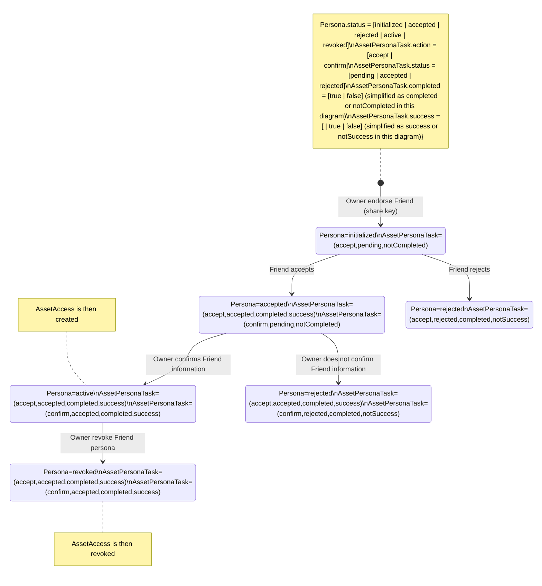

```mermaid
stateDiagram-v2

[*] --> Persona=initialized\nAssetPersonaTask=(accept,pending,notCompleted): Owner endorse Friend (share key)
Persona=initialized\nAssetPersonaTask=(accept,pending,notCompleted) --> Persona=accepted\nAssetPersonaTask=(accept,accepted,completed,success)\nAssetPersonaTask=(confirm,pending,notCompleted): Friend accepts
Persona=initialized\nAssetPersonaTask=(accept,pending,notCompleted) --> Persona=rejectednAssetPersonaTask=(accept,rejected,completed,notSuccess): Friend rejects
Persona=accepted\nAssetPersonaTask=(accept,accepted,completed,success)\nAssetPersonaTask=(confirm,pending,notCompleted) --> Persona=active\nAssetPersonaTask=(accept,accepted,completed,success)\nAssetPersonaTask=(confirm,accepted,completed,success): Owner confirms Friend information
note left of Persona=active\nAssetPersonaTask=(accept,accepted,completed,success)\nAssetPersonaTask=(confirm,accepted,completed,success): AssetAccess is then created
Persona=accepted\nAssetPersonaTask=(accept,accepted,completed,success)\nAssetPersonaTask=(confirm,pending,notCompleted) --> Persona=rejected\nAssetPersonaTask=(accept,accepted,completed,success)\nAssetPersonaTask=(confirm,rejected,completed,notSuccess): Owner does not confirm Friend information
Persona=active\nAssetPersonaTask=(accept,accepted,completed,success)\nAssetPersonaTask=(confirm,accepted,completed,success) --> Persona=revoked\nAssetPersonaTask=(accept,accepted,completed,success)\nAssetPersonaTask=(confirm,accepted,completed,success): Owner revoke Friend persona
note right of Persona=revoked\nAssetPersonaTask=(accept,accepted,completed,success)\nAssetPersonaTask=(confirm,accepted,completed,success): AssetAccess is then revoked
note left of [*]: Persona.status = [initialized | accepted | rejected | active | revoked]\nAssetPersonaTask.action = [accept | confirm]\nAssetPersonaTask.status = [pending | accepted | rejected]\nAssetPersonaTask.completed = [true | false] (simplified as completed or notCompleted in this diagram)\nAssetPersonaTask.success = [ | true | false] (simplified as success or notSuccess in this diagram)}
```
