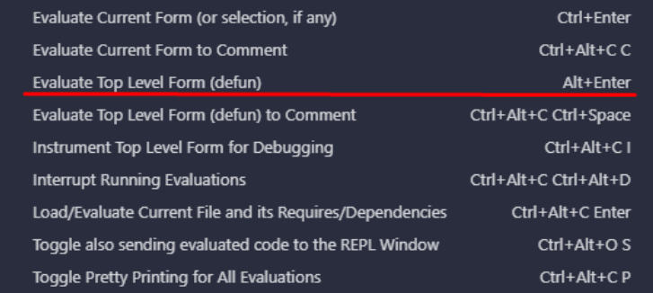

# Setting up the feature flags through a Clojure REPL

This process is done through a Clojure script connected to the server that has a REPL running in a specific port. We usually use [gossm](https://github.com/gjbae1212/gossm) to forward the 9877 port with the command
```
gossm fwd --local 9877 --remote 9877
```

You can connect to this port and run Clojure code using a VSCode extension called [Calva](https://marketplace.visualstudio.com/items?itemName=betterthantomorrow.calva)

Using Calva extensions in vscode:
- Ctrl + shift + P: Calva: connect to a running repl server, not in the project
- Choose the deps.edn option;
- Enter localhost:9877 as the url and port in the following popup;



The following code is required to setup a feature flag in the production environment, you can paste the snippets in a file and run them with ALT+Enter (Evaluate top level form) or CTRL+Enter (Evaluate selection).

```clj
(in-ns 'io.vouch.debug-repl.feature-flags)

(require '[io.vouch.debug-repl.crypto-id :as crypto-id])

(set-feature
  "FEATURE-FLAG-NAME"
  true
  (crypto-id/prod-crypto-identity-context) ;; Use (dev-crypto-identity-context) instead for DEV or STG environments.
  nil) ;; Aditional options.
```

In calva you’ll see the return of each line execution beside it with a “=>” sign like in the following example.
```clj
(set-feature "FEATURE-FLAG-NAME" true (crypto-id/prod-crypto-identity-context)) => "Feature FEATURE-FLAG-NAME toggled to: true"
```

## Example, the basic-validator-node-changes flag

```clj
(in-ns 'io.vouch.debug-repl.validators)
;; IMPORTANT! You need to set the initial-validators set below.

;; Retrieve the validator keys using
(clojure.pprint/pprint (get-validators (util/get-tendermint-url) true))

;; Copy each public key and add to the initial-validators array as strings:
(def initial-validators [])
```

```clj
  ;; It should look like:
;; (def initial-validators
;;     [“22CCC542981B5C6637815543B47CDC3D06E05A58E77D07F119423E191AD62CCf”
;;      “22CCC542981B5C6637815543B47CDC3D06E05A58E77D07F119423E191AD62CCf”
;;      “22CCC542981B5C6637815543B47CDC3D06E05A58E77D07F119423E191AD62CCf”
;;      “22CCC542981B5C6637815543B47CDC3D06E05A58E77D07F119423E191AD62CCf”])

(feature-flags/set-feature
 "basic-validator-node-changes"
 true
 (crypto-id/prod-crypto-identity-context)
 {:io.vouch.digital-key.abci.governance.validators/validators initial-validators})
```

## Example, the tendermint-drop-history-flag

```clj
  (in-ns 'io.vouch.debug-repl.feature-flags)

  (set-feature "tendermint-drop-history-flag" true (dev-crypto-identity-context) {:retention-period "P14D"})
```

## Example, setting multiple feature flags

```clj
  (def feature-flags
   ["fix-abci-error-wrapper"
    "asset-access-auth-doc-offline-device-flag"
    "find-asset-device-by-asset-query-fix"
    "preserve-smt-root"
    "rpc-enroll-asset-device-replace-existing-asset-device"
    "service-api-asset-device-auth-doc-creation"
    "suspend-and-reactivate-friends-for-rental"
    "validate-membership-enroll-and-endorse-key-device-guard"
    "disable-smt-storage"])

  (doseq [feature feature-flags]
    (set-feature feature true (crypto-id/prod-crypto-identity-context) nil))
```
