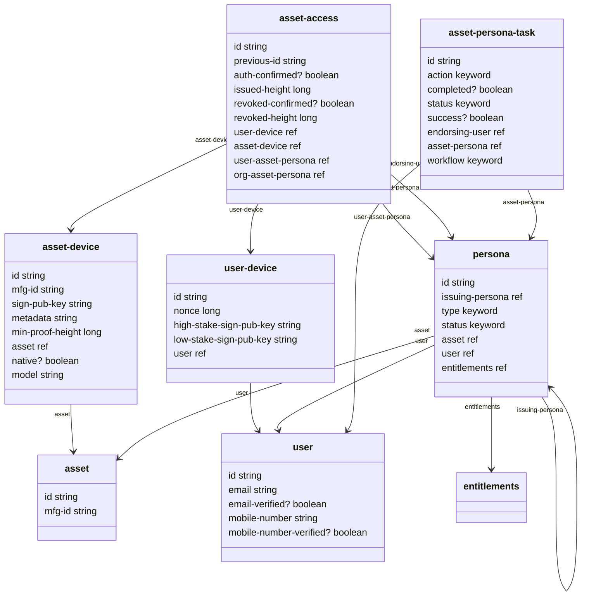

# Vouch Entities

This is an overview of the main entities stored in Datomic and their relationships.

```mermaid
classDiagram
`asset`
`asset-access`
`asset-device`
`user`
`user-device`
`persona`
`asset-persona-task`
`block`
`entitlements`
`abci`
`asset`: id string
`asset`: mfg-id string
`asset-access`: id string
`asset-access`: previous-id string
`asset-access`: auth-confirmed? boolean
`asset-access`: issued-height long
`asset-access`: revoked-confirmed? boolean
`asset-access`: revoked-height long
`asset-access`: user-device ref
`asset-access`: asset-device ref
`asset-access`: user-asset-persona ref
`asset-access`: org-asset-persona ref
`asset-device`: id string
`asset-device`: mfg-id string
`asset-device`: sign-pub-key string
`asset-device`: metadata string
`asset-device`: min-proof-height long
`asset-device`: asset ref
`asset-device`: native? boolean
`asset-device`: model string
`user`: id string
`user`: email string
`user`: email-verified? boolean
`user`: mobile-number string
`user`: mobile-number-verified? boolean
`user-device`: id string
`user-device`: nonce long
`user-device`: high-stake-sign-pub-key string
`user-device`: low-stake-sign-pub-key string
`user-device`: user ref
`persona`: id string
`persona`: issuing-persona ref
`persona`: type keyword
`persona`: status keyword
`persona`: asset ref
`persona`: user ref
`asset-persona-task`: id string
`asset-persona-task`: action keyword
`asset-persona-task`: completed? boolean
`asset-persona-task`: status keyword
`asset-persona-task`: success? boolean
`asset-persona-task`: endorsing-user ref
`asset-persona-task`: asset-persona ref
`asset-persona-task`: workflow keyword
`persona`: entitlements ref
`asset-access` "user-device" --> `user-device`
`asset-access` "asset-device" --> `asset-device`
`asset-access` "user-asset-persona" --> `persona`
`asset-access` "org-asset-persona" --> `persona`
`asset-device` "asset" --> `asset`
`user-device` "user" --> `user`
`persona` "issuing-persona" --> `persona`
`persona` "asset" --> `asset`
`persona` "user" --> `user`
`asset-persona-task` "endorsing-user" --> `user`
`asset-persona-task` "asset-persona" --> `persona`
`persona` "entitlements" --> `entitlements`

```

